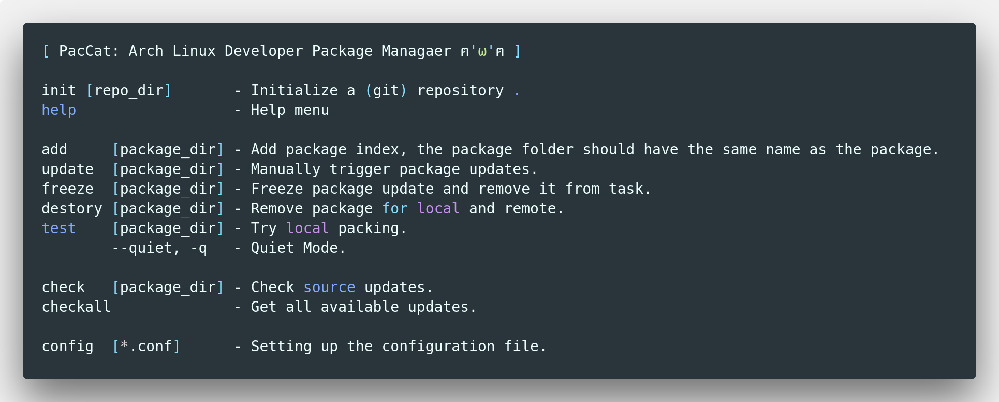

# paccat

Arch Linux Developer Package Managaer.



## Install

## Usage

For testing and developing, you can build this project on local.

```
$ git clone https://github.com/axionl/paccat.git
$ cd paccat
$ go build
$ ./paccat help
```

And if you wanna packing, you need to be root.